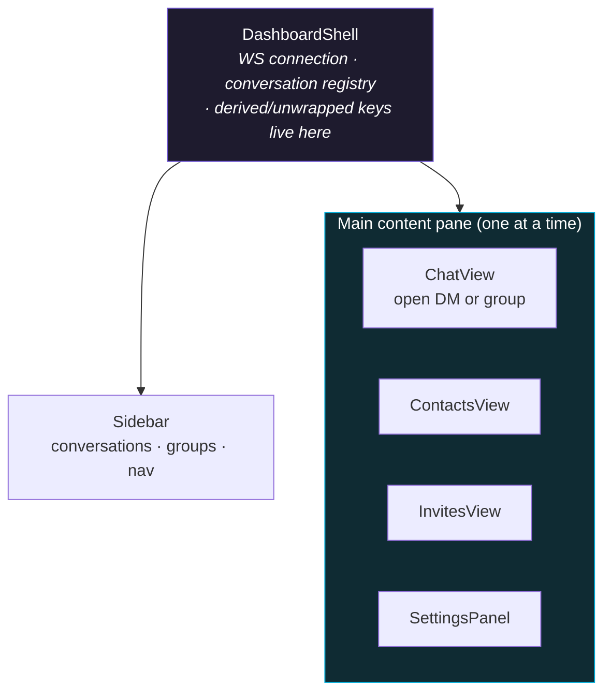
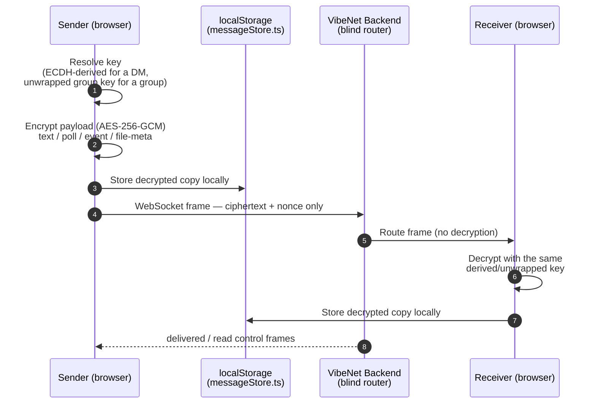

<div align="center">

# VibeNet Frontend — E2EE Chat Client

[](https://nextjs.org/)
[](https://www.typescriptlang.org/)
[](https://tailwindcss.com/)
[](#-end-to-end-encryption)
[](https://vibe-net-frontend.vercel.app)

**Next.js client for VibeNet — a real-time, end-to-end encrypted, WhatsApp-style chat app.**

[Features](#-features) · [Architecture](#-architecture--visualizations) · [Tech Stack](#tech-stack) · [Getting Started](#getting-started) · [Project Structure](#project-structure)

</div>

This repository is consumed as a Git submodule by the [VibeNet-Main](https://github.com/ChamathDilshanC/VibeNet-Main) orchestrator. Live at **[vibe-net-frontend.vercel.app](https://vibe-net-frontend.vercel.app)**, talking to the Go backend at `https://vibenet-api.duckdns.org`.

---

## Overview

VibeNet's client generates its user's encryption keypair **in the browser** and never sends a private key or a plaintext message body anywhere. Every REST call and WebSocket frame the backend sees is either metadata (who, when, which room) or opaque ciphertext — text, files, polls, and events alike are encrypted client-side before they leave the device and decrypted only after they arrive.

---

## ✨ Features

- **1:1 and group messaging** — real-time delivery over WebSocket, offline catch-up via REST history, reply-to-message, forward, delete-for-me / delete-for-everyone (synced via a `delete_notice` frame), typing indicators, and WhatsApp-style delivery ticks (sent / delivered / read).
- **Groups** — create, rename, re-photo; owner/admin/member roles; invite → accept/decline; add/remove members; promote/demote; leave with automatic ownership handoff.
- **Rich message types** — encrypted image/file attachments, polls with live vote tallying, calendar events, and shared contact cards — each its own `MessageKind`, all carried inside the same encrypted envelope as text.
- **Local-first client state** — decrypted messages, conversations, and per-room "last read" watermarks are cached in `localStorage`, so history, unread badges, and delivery ticks survive a reload without re-deriving anything.
- **Identity & security** — email/password and Google OAuth sign-in, per-account ECDH keypair generated on first use, anti-spam rotating 4-digit PIN gating a stranger's first DM, avatar upload, account deactivation/deletion.
- **Presence & UX polish** — online/last-seen status, live typing indicators, a connection-status indicator that reflects WebSocket reconnects, emoji picker, dark/light theming, toast notifications.

---

## 🏗 Architecture & Visualizations

### Diagram A — App Shell

`DashboardShell` owns the single live WebSocket connection, the client-side conversation registry, and the per-peer/per-group derived encryption keys. Switching between panes never tears the socket down — it's swapped in place, Discord-style.



### Diagram B — Client-Side E2EE Send/Receive Flow



> File attachments add one more layer: each file gets its own random AES-256-GCM key, encrypted client-side and PUT straight to S3 via a presigned URL — the file's key/IV then rides *inside* the already-encrypted message envelope above, so the backend never sees file bytes either.

---

## Tech Stack

- **[Next.js](https://nextjs.org/)** (App Router) + **TypeScript**
- **Tailwind CSS v4** for layout and components
- **[Astryx](https://github.com/facebook/astryx)** `neutral` theme — supplies the design-token/dark-mode CSS variables consumed across the app (`data-astryx-theme="neutral"` in [`src/app/layout.tsx`](src/app/layout.tsx)); components themselves are hand-built with Tailwind, not Astryx's component library
- **Heroicons** + **lucide-react** for icons, **framer-motion** for animation, **goey-toast** for toasts, **next-themes** for light/dark switching
- **Web Crypto API** (native browser `crypto.subtle`) for all encryption — no third-party crypto library

## Getting Started

```bash
npm install
npm run dev
```

Open [http://localhost:3000](http://localhost:3000). Point the client at a backend via `.env.local`:

```dotenv
# Defaults to http://localhost:8080 if unset
NEXT_PUBLIC_API_BASE_URL=http://localhost:8080
```

### Scripts

| Command | Description |
|---------|-------------|
| `npm run dev` | Start the development server |
| `npm run build` | Create an optimized production build |
| `npm run start` | Serve the production build |
| `npm run lint` | Run ESLint |

## Project Structure

```
src/
  app/
    page.tsx                    # Landing page (/) — brand, description, Login/Register CTAs
    login/page.tsx               # Email/password + Google sign-in
    register/page.tsx            # Registration — generates the ECDH keypair client-side
    dashboard/page.tsx            # Authenticated app shell entry point
    auth/callback/page.tsx        # Post-auth landing/redirect handling
    auth/google-success/page.tsx  # Captures the JWT after a Google OAuth redirect
    layout.tsx                   # Root layout — global styles, Astryx neutral theme
    globals.css                  # Tailwind + Astryx reset/core/theme imports

  components/
    DashboardShell.tsx           # App shell: WS connection, conversation registry, key derivation
    ChatView.tsx                 # Message list, composer, group/DM header
    Sidebar.tsx                  # Conversation/group list and navigation
    ContactsView.tsx / InvitesView.tsx / SettingsPanel.tsx   # Discord-style alternate panes
    CreateGroupDialog.tsx / GroupDetailsDialog.tsx / InviteMemberDialog.tsx / GroupContextMenu.tsx
    CreatePollDialog.tsx / PollMessageCard.tsx / PollResultsDialog.tsx
    CreateEventDialog.tsx / EventMessageCard.tsx
    ContactShareDialog.tsx / ContactMessageCard.tsx / ForwardDialog.tsx
    MessageAttachment.tsx / AttachmentMenu.tsx           # Encrypted file/image attachments
    MessageContextMenu.tsx / DeliveryTicks.tsx / TypingIndicator.tsx / EmojiPicker.tsx
    PinInput.tsx / PinPromptDialog.tsx / DangerZoneConfirmDialog.tsx
    AuthShell.tsx / GoogleButton.tsx / ThemeProvider.tsx / Toaster.tsx / Footer.tsx / EmptyState.tsx

  lib/
    e2ee.ts             # ECDH keypair gen, pairwise key derivation, group-key generate/wrap/unwrap
    fileCrypto.ts       # Per-file AES-256-GCM encryption for attachments
    upload.ts           # Presigned S3 upload/download exchange
    attachmentCache.ts  # LRU cache of decrypted attachment blob: URLs
    messageStore.ts     # Local decrypted-message cache, delivery status, message kinds
    conversations.ts    # Client-side DM registry (the backend has no "conversations" concept)
    groups.ts           # Group/invite REST calls, role helpers, member-name resolution
    readState.ts        # Per-room "last read" watermark backing unread badges
    session.ts          # JWT + user persistence
    user.ts             # Authenticated calls for the caller's own profile
    api.ts / apiClient.ts   # Base API client — reads NEXT_PUBLIC_API_BASE_URL, attaches the JWT
```

## Deployment

Deployed on **Vercel** via its native Git integration — a push to `main` builds and ships automatically. Set `NEXT_PUBLIC_API_BASE_URL` as a Vercel project environment variable pointing at the production backend (`https://vibenet-api.duckdns.org`), and make sure that backend's `CORS_ALLOWED_ORIGINS` includes this app's deployed origin (see [`backend/README.md`](https://github.com/ChamathDilshanC/VibeNet-backend#readme)).

---

Developed by **Chamath Dilshan** ([@ChamathDilshanC](https://github.com/ChamathDilshanC))
